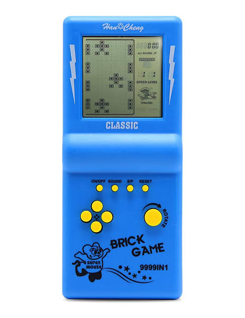

# retro-car-racing

# Mi proyecto de [Core Code School](https://www.corecode.school/)

# Indice:

-   [retro-car-racing](#retro-car-racing)
-   [Mi proyecto de Core Code School](#mi-proyecto-de-core-code-school)
-   [Indice:](#indice)
    -   [1. Título del Juego:](#1-título-del-juego)
    -   [2. Imágenes y vídeos:](#2-imágenes-y-vídeos)
    -   [3. Motivación del proyecto:](#3-motivación-del-proyecto)
    -   [4. Acceso directo al juego:](#4-acceso-directo-al-juego)
    -   [5. Tabla de contenidos o índice:](#5-tabla-de-contenidos-o-índice)
    -   [6. Manual de instalación y deployment:](#6-manual-de-instalación-y-deployment)
    -   [7. Ejemplos de código:](#7-ejemplos-de-código)
    -   [8. Entornos de ejecución:](#8-entornos-de-ejecución)
    -   [9. Listado de paquetes y dependencias:](#9-listado-de-paquetes-y-dependencias)
    -   [10. Agradecimientos:](#10-agradecimientos)

## 1. Título del Juego:

Car racing

## 2. Imágenes y vídeos:



## 3. Motivación del proyecto:

Car race es uno de los juego más famosos de la Brick Game 9999 in 1. Cuya dinamica es adelantar coches, moviendose de izquierda a derecha para adelantar. Con el paso del tiempo cada vez va más deprisa y cada vez hay más tráfico y más junto, siendo fácil chocar. Al mas mínimo roce perderemos. Este juego me trae muy buenos recuerdos, ya que en antaño me podia tirar las horas muertas jugando con mis hermanos. Es por eso, que he querido intentar al menos hacer una pequeña replica de ello.

## 4. Acceso directo al juego:

[Pincha aquí para poder acceder](nadaronda.github.io/retro-car-racing/)

## 5. Tabla de contenidos o índice:

Mi proyecto se estructura en diferentes carpetas y un único html y css.

Carpetas:

-   img: con las imagenes utilizadas en el proyecto.
-   src: contiene todos los archivos TS divididos por distintas carpetas:
-   actors: actores del proyecto

    -   Actor.ts
    -   Car.ts
    -   CarEvil.ts
    -   Enemies.ts
    -   FPSViewers.ts
    -   Map.ts

-   types:
    -   Point.ts: posicion de los actores en el mapa
    -   Size.ts: define el Width y el height de los actores
-   utils:
    -   distance.ts: formula de distancia entre dos puntos
    -   checklimits.ts:
    -   getCanvas.ts:
-   main.ts dónde se entrelazan todos los archivos.

## 6. Manual de instalación y deployment:

```
Clone the repository:
    git clone https://github.com/nadaronda/Canvas_Retro_Car_Racing

Initiate npm:
    npm init

Or use this instead:
    npm init -y

Install dependencies:
    npm install

Execute the project:
    npm run dev

```

## 7. Ejemplos de código:

Para detectar colisiones, es importante meter el actor en una variable externa, para luego pasar el mismo actor a los enemigos con los que quiere colisionar. Este ejemplo se encuentra en el archivo de main.ts

```ts
const player: Car = new Car(
    { x: canvasMid.x, y: canvas.height - 39 },
    { w: 80, h: 108 }
);

const enemies = new Enemies({ position: { x: 0, y: -1020 }, car: player });

const actors: Actor[] = [new FPSViewer(), player, ...enemies.CarEvils];
```

Como calcular la colision entre dos actores, añadiendo la formula de la distancia entre dos puntos. Es bueno parametrizarla, para poder utilizarla siempre que puedas.Este ejemplo se encuentra en el archivo de Distance.ts, esta constante se utiliza en el enemigo en el metodo update().

```ts
export const distancia = (obj1Position: Point, obj2Position: Point) => {
    return Math.sqrt(
        Math.pow(obj1Position.x - obj2Position.x, 2) +
            Math.pow(obj1Position.y - obj2Position.y, 2)
    );
};
```

## 8. Entornos de ejecución:

-   El juego estará desarrollado en HTML Canvas Graphics
-   Trabajado en el entorno de Node.js
-   Lenguaje de programacion typescript
-   Se utiliza npm como gestor de paquete

-   [Visual Studio Code](https://code.visualstudio.com/Download)

## 9. Listado de paquetes y dependencias:

-   Node package manager: [npm](https://www.npmjs.com/)
-   To run the HTML: [Vite](https://vitejs.dev/)

-   Lenguajes de programación: [typescript](https://www.npmjs.com/package/typescript)
-   Otros paquetes de Node: Lodash
-   MDN [Api Canvas](https://developer.mozilla.org/es/docs/Web/API/Canvas_API)

## 10. Agradecimientos:

Agradecimientos principalemente a Core code school por la oportunidad que me estan dando. A mi profesor Juan Pablo. Y a mi familia por su gran apoyo.
